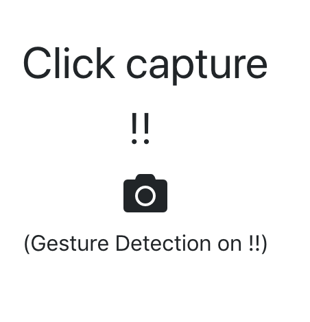

# Object detection using webcam images

   This App is capable of doing `Object Detection` in 3 ways,

### 1. Camera Mode:

  Provide webcam access for this page during load. Once loaded, you can take snapshots from the UI and send it for inference. This model used here is ssd_mobilenet_v1_coco [Reference](https://github.com/tensorflow/models/blob/master/research/object_detection/g3doc/detection_model_zoo.md).


  For inferencing, this application expects a model inferencing service running in port 8888. So refer `runserver2.py` to start this service.

  This page is also capable for 2 gesture detection,

	1. Give a thumbs up to take a screenshot.
	2. Show a high 5 to stop the gesture detection.



	Note: Tensorflow.js is used here. The model used here is mobilenet. [Reference](https://github.com/tensorflow/tfjs-examples/tree/master/mobilenet)

### 2. File Mode:

	Upload local image file for inferencing using the same model ssd_mobilenet_v1_coco.


	This inferencing is also obtained from the model inferencing service mentioned above.

### 3. Live Mode:
	
  Perform live object detection using the ssd_mobilenet_v1_coco model. 
  
  
  
  To make it run in browser, a webmodel is created as follows,

```
	$ tensorflowjs_converter     --input_format=tf_frozen_model  \
	     --output_node_names="num_detections, detection_boxes,   \
	     detection_scores, detection_classes"                    \
	     ./model/frozen_inference_graph.pb                       \
	     ./web_model
```

  Then this webmodel is used for further live predictions.

###  Note:

  The pre-trained tensorflow.js models are also provided in this repo. Make sure you copy them to the `dist` folder before starting the node application.

### Steps to run this example,

Clone this Repo,

To install all the nodejs dependency modules,

```
$ yarn
```

Create a runtime bundle, 

```
$ yarn build

```

Start the nodejs server in port 8081, (make sure you copy the pre-trained models to `dist` folder)

```
$ yarn start
```

Start the model inferencing service,

```
$ python runserver2.py
```

This application is still in prototype phase and developed during the Hackathon event happened on Nov 16th 2018. 


# License
[Apache 2.0](LICENSE)
